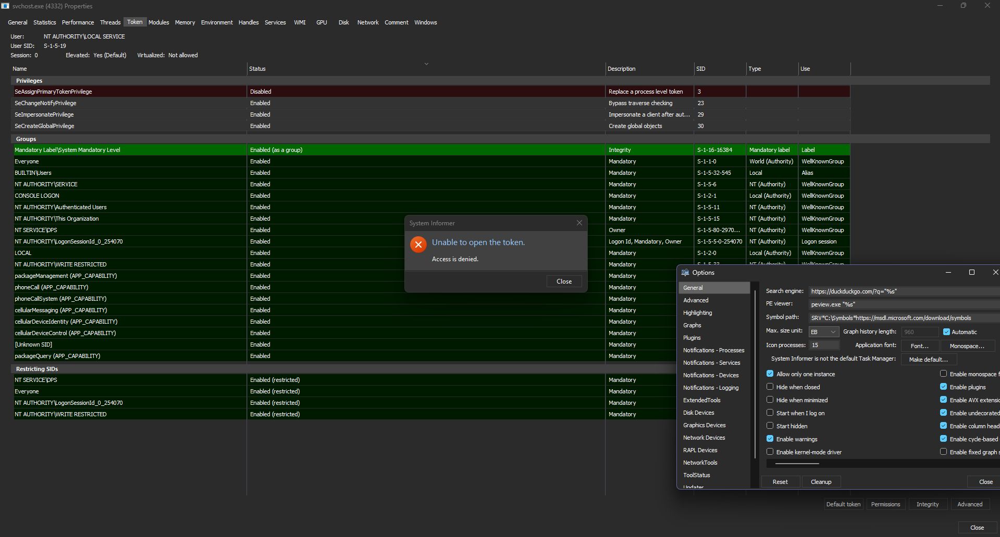
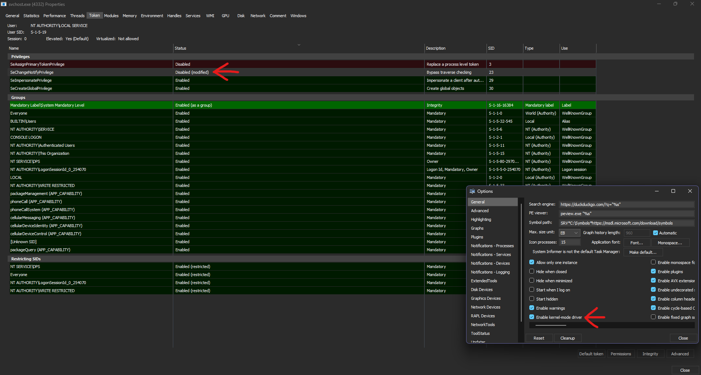

**Tokenizator** demonstrates how to 'bypass' the Windows UAC model, programmatically and fully in usermode, by impersonating a PPL process's security context.

When running with SeDebugPrivilege as an administrator (the higher debugging privilege you can get from ring 3, without hijacking or running your process as TrustedInstaller), the Security Reference Monitor blocks attempts to modify other service processes' tokens, returning STATUS_ACCESS_DENIED (5), as seen with System Informer.

 

In Windows 24H2, System Informer needs its kernel driver to tamper with tokens in other processes.

# Overview
The SRM kernel component checks whether the process’s token has the required privileges or access rights for the requested operation. For example, a process may need the SeDebugPrivilege to access another process’s handle if it is not part of the same user context. UAC helps restrict high-privilege actions, but can be bypassed by impersonating a process with elevated privileges, like LSASS.

LSASS runs with SYSTEM-level privileges, with the NT AUTHORITY\SYSTEM account, which has full administrative rights to the system. It can access and manipulate other processes running on the system. This includes querying or modifying the tokens of other service processes, interacting with their memory, or even impersonate tokens (which we will do). However, there's an issue. LSASS is a Protected Process Light process.

PPL is designed to protect processes like LSASS, CNG Key Isolation, and others from being debugged, modified, or injected with code. These processes have a higher level of protection than standard processes but don't require the strictest protections of PP. In the Process Object, a PPL process has a special flag set that designates it as "protected." This flag in the process's Process Control Block (PS_PROTECTED_PROCESS) is checked by the kernel and is used to control access to the process. Any attempt to call NtOpenProcess with higher access rights than PROCESS_QUERY_LIMITED_INFORMATION will fail, meaning we can't hijack any handles, tokens, etc without duplicating them in our own virtual address space and setting the thread's impersonation token to this token.

This is exactly what Tokenizator does, a thread has an impersonation access token that describes the security context of the client being impersonated. After impersonating lsass, Tokenizator gets access to tamper with the _SID_AND_ATTRIBUTES structure of external processes, allowing the manipulation of security identifiers. This access token model of windows is intentional, but can be abused.
